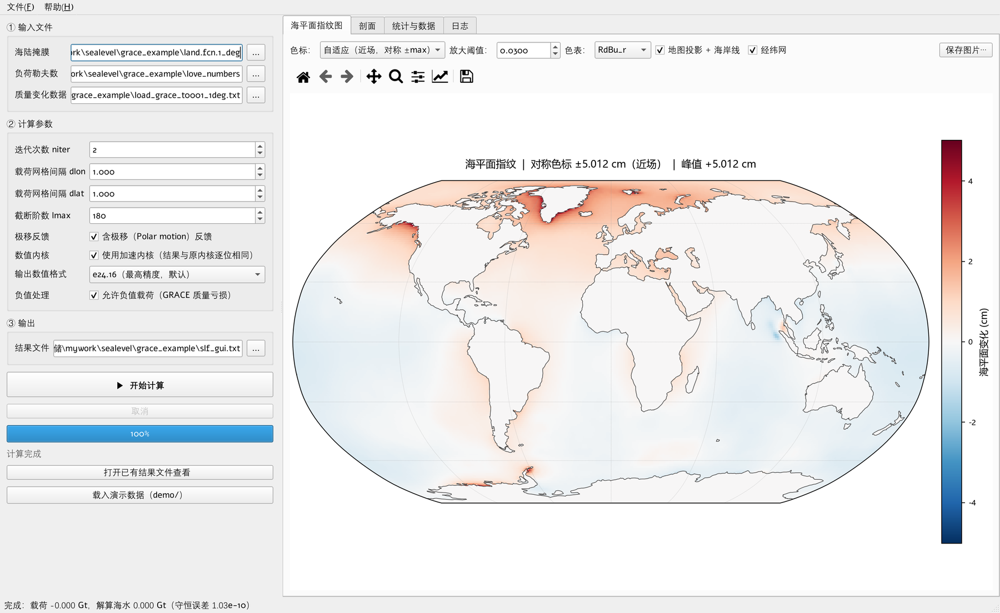
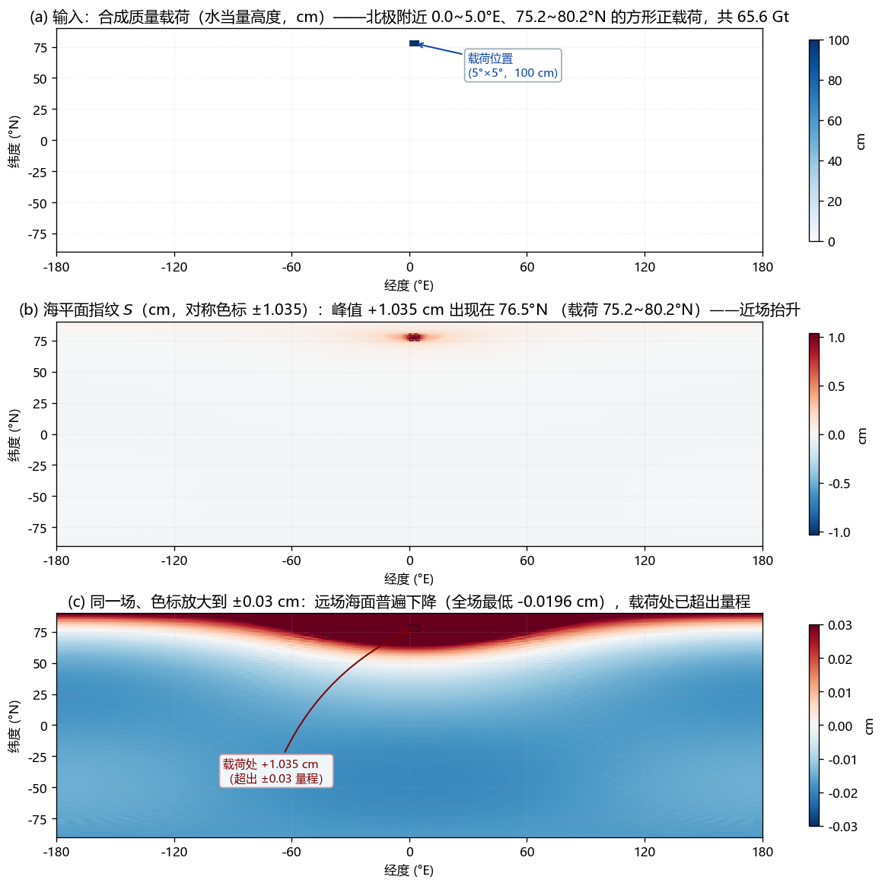

# 海平面指纹（SLF）计算程序

由全球表面质量变化网格求解海平面方程，给出相应的**海平面指纹**（Sea Level Fingerprints）分布。

Windows 10/11（64 位）桌面程序 · 免费 · 完全离线运行

**[⬇ 下载最新版 v1.0.1](https://github.com/pengzhenran/sleqn/releases/latest)**



## 功能

- 输入海陆掩膜、负荷勒夫数、质量变化网格三个文本文件，输出每个 1° 格点的海平面变化（厘米）
- 载荷可以是 GRACE/GRACE-FO 反演的陆地水储量变化，也可以是冰盖、地下水模型给出的等效水高网格
- 界面内可查看指纹图（等经纬 / Robinson 投影）、经/纬向剖面、质量守恒自检与结果预览，图片可导出 PNG/PDF
- 随包提供真实的 CSR GRACE/GRACE-FO RL06.3 mascon 示例数据（1° 网格）与 PREM 负荷勒夫数，点「载入演示数据」即可走完整条流程，全球算例十几秒完成
- 球谐截断阶数、勒夫数表、算例大小与网格间隔可调；极移（自转）反馈可开关
- 完全离线：不联网，也不上传任何数据



*合成算例：北极附近一块 5°×5° 的正载荷（65.6 Gt）。载荷附近海面抬升，远场海面下降。*

## 精度

把本程序算出的载荷球谐系数原样取出，分别输入两套独立的第三方实现，并与一个解析闭式解对照。三方输入逐位相同，差异只可能来自求解器本身。

| 对照对象 | 算例 | 最大偏差（占峰值） | 相关系数 |
| --- | --- | --- | --- |
| 解析闭式解 | 合成算例 | 0.029% | 0.99999997 |
| gravity-toolkit | 合成算例 | 0.030% | 0.99999997 |
| gravity-toolkit | 真实 GRACE | 0.022% | 0.99999999 |
| pyslfp 2.0.6 | 全球海洋 + 光滑载荷 | 0.537% | 0.99999919 |

两个独立参考之间只差 0.0045%，本程序与它们的偏差为峰值的万分之二到万分之三。与 pyslfp 的 0.5% 主要来自负荷勒夫数表不同（pyslfp 用自带的 PREM_4096，本程序用 Wang et al. 2012 PREM）与地球半径取值差异，两者勒夫数的响应因子本身即相差 0.19%。

## 下载与安装

- 安装包约 52.9 MB，安装后占用约 200 MB，建议内存 8 GB 以上
- 下载：[Releases](https://github.com/pengzhenran/sleqn/releases/latest) 页面中的 `sleqn_Setup_v1.0.1.exe`
  （GitHub 的资产名不支持中文，这里用 ASCII 名；它与网盘分发的 `海平面指纹_Setup_v1.0.1.exe` 是同一个文件，可对比下面的 SHA256）
- 国内下载较慢，也可以用夸克网盘：<https://pan.quark.cn/s/1e1e71df51ce>（二维码见文末）
- 双击安装程序按向导完成，桌面和开始菜单会生成快捷方式；卸载通过「设置 → 应用」或开始菜单中的卸载项

SHA256（v1.0.1）：

```
3AE0683A82B223A60473B151BBAA585E2D31B586E941DA06E0AA884066ADF09C
```

### 首次运行可能被 Windows 拦下

程序与安装包都没有代码签名。新装的 Windows 11 上会遇到下面两种提示之一：

| 提示 | 怎么办 |
| --- | --- |
| 「Windows 已保护你的电脑 / 未知发布者」 | 点「更多信息」→「仍要运行」 |
| 「智能应用控制已阻止可能不安全的应用」 | 这是 Windows 11 的智能应用控制，**没有单应用白名单**：设置 → 隐私和安全性 → Windows 安全中心 → 应用和浏览器控制 → 智能应用控制 → 关闭，然后重新双击程序（不必重装） |

换安装目录、卸载重装都不能绕过第二种提示——它只看数字签名，不看路径。关闭智能应用控制不影响 Windows 自带的病毒防护。

## 验证安装

```cmd
"C:\Program Files\海平面指纹\sleqn.exe" --selftest
```

程序会检查随包文件、离线底图、数值内核与出图，最后打印 `20/20 项通过`；退出码 0 表示一切就绪。

## 使用注意

- 质量变化数据的单位是**米当量水高**；GRACE mascon 原始产品是厘米，需要除以 100
- `dlon` / `dlat` 必须与数据的实际网格间隔一致（真实 GRACE 1° 数据要写成 `--dlon 1 --dlat 1`）
- GRACE 的质量亏损是负值，必须允许负值载荷（命令行 `--allow-negative`，图形界面默认已勾选）
- 定量分析（趋势、区域平均）时把迭代次数设到 10 以上；默认的 2 次与完全收敛解相差约 1%

程序内按 F1 可打开完整中文使用说明。

## 引用

本程序实现并求解海平面方程，方法出自：

1. 王林松, 陈超, 马险, 杜劲松. 冰盖消融的海平面指纹变化及其对 GRACE 监测结果的影响[J]. 地球物理学报, 2018, 61(7): 2679–2690. doi:10.6038/cjg2018L0335
2. Sun J. W., Wang L. S., Peng Z. R., Fu Z. Y., Chen C (2022). The sea level fingerprints of global terrestrial water storage changes detected by GRACE and GRACE-FO data. Pure and Applied Geophysics, 179(9), 3303–3317. doi:10.1007/s00024-022-03099-5

在论文或报告中使用了本程序的计算结果，请引用上述文献。

## 许可与第三方组件

本仓库内容采用 [MIT 许可](LICENSE)。安装目录下 `_internal\licenses\` 提供完整的第三方组件声明与许可全文（`NOTICE.txt`、`LGPL-3.0.txt`、`GPL-3.0.txt`）；程序依据 LGPL-3.0 以未修改的动态库方式使用 Qt for Python (PySide6)。

## 反馈

作者：彭桢燃（中国地质大学（武汉））　邮箱：zhenran.peng@cug.edu.cn

使用中遇到问题、发现异常结果，或希望增加新功能，欢迎提交 [Issue](https://github.com/pengzhenran/sleqn/issues) 或邮件反馈；反馈时附上程序「日志」页签的内容，便于定位。

## 关注与获取

| 课题组公众号「地球重力与人类生活（TVGG）」 | 夸克网盘（安装包，国内下载更快） |
| :---: | :---: |
|  |  |
| 扫码关注，获取工具与更新 | 扫码打开网盘分享（`海平面指纹_Setup_v1.0.1.exe`） |

