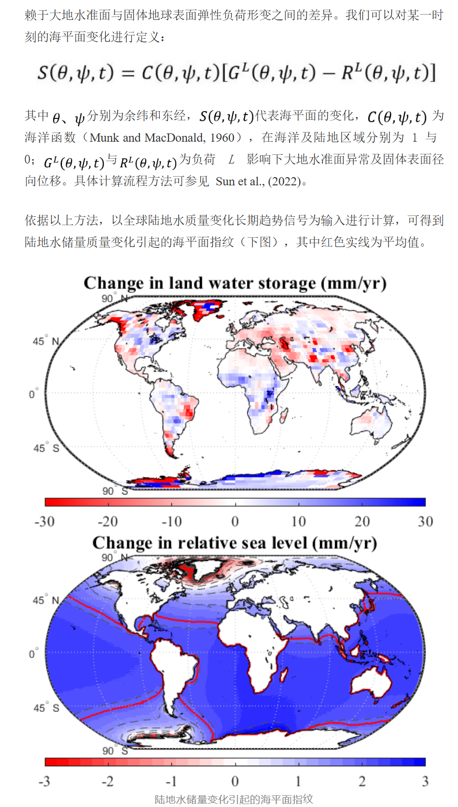

# 海平面指纹（Sea Level Fingerprints, SLF）

> **整理说明**
> 本文由同名 `.txt` 文件整理而成，只做了分节、断行、标点与排版层面的整理，文字内容未作改写。
> 原文中的**公式、示意图在纯文本中为图片**、会丢失；本次已根据作者提供的原文截图补齐：
> 海平面方程 $S(\theta,\psi,t)=C\,[G^{L}-R^{L}]$ 及其全部符号说明（见第二节），
> 以及"陆地水储量变化 → 海平面指纹"的结果图（见第三节）。
> 文中凡属整理者补充的说明，均以 `〔整理者注〕` 标明。
> 另附：原文 Fortran95 代码 `sleqn.f90`、修正版 `sleqn_dp.f90`、Python 版 `sleqn.py`
> 及使用说明 `README_sleqn.md`。

---

## 一、研究背景与意义

海洋、陆地，及大气三者之间在全球范围内的水体交换，将导致水质量不均匀地重新分配，伴随冰川均衡调整，会激发固体地球的弹性和黏弹性响应，继而造成全球海平面呈现出空间差异，具有典型的区域性特征，即**海平面指纹（Sea Level Fingerprints, SLF）**。

早在 19 世纪学者们就意识到这种指纹效应，并给出了最基本的物理解释。近些年来，随着冰盖冰川整体消融的加速，主要受这些因素驱动的海平面指纹逐渐成为区域海平面的主要表征形式。因此，在研究海洋问题时，考虑海平面指纹的影响变得愈发重要。

研究大洋间水体质量交换时，海平面指纹的差异可能导致估算的海水迁移质量改变一半左右（Hsu and Velicogna, 2017）；利用卫星测高和卫星重力数据，更精准地监测格陵兰及南极冰盖的消融、区域乃至全球海平面的变化，考虑海平面指纹的渗透影响是其中的关键（Adhikari et al., 2019; Pfeffer et al., 2018; Wang et al., 2018）。除此之外，对海洋区域气候事件的追踪（Pico et al., 2020）、冰川均衡调整（GIA）的探究（Simon et al., 2018）、潮汐的监测（Ross et al., 2017），以及大地震对海洋质量变化的影响研究（Tang et al., 2020），海平面指纹的影响都是需要重点关注的问题。

---

## 二、海平面指纹的计算原理

计算海平面指纹需要借助**海平面方程**。在只考虑弹性响应影响下，计算主要依赖于**大地水准面**与**固体地球表面弹性负荷形变**之间的差异。

我们可以对某一时刻的海平面变化进行定义：

$$S(\theta,\psi,t) = C(\theta,\psi,t)\left[\,G^{L}(\theta,\psi,t) - R^{L}(\theta,\psi,t)\,\right]$$

其中：

- $\theta$、$\psi$ —— 分别为余纬和东经
- $S(\theta,\psi,t)$ —— 代表海平面的变化
- $C(\theta,\psi,t)$ —— 为海洋函数（Munk and MacDonald, 1960），在海洋及陆地区域分别为 1 与 0
- $G^{L}(\theta,\psi,t)$ 与 $R^{L}(\theta,\psi,t)$ —— 为负荷 $L$ 影响下大地水准面异常及固体表面径向位移

具体计算流程方法可参见 Sun et al., (2022)。

> 求解时还需叠加一个 0 阶常数项，以保证海水质量守恒（等价于全球海洋质量变化 = 陆地水质量变化的相反数），代码中即为迭代里不断修正的 `amass`。〔整理者注〕

### 代码中的物理量与对应关系

| 公式符号 | 代码变量 | 含义 |
| --- | --- | --- |
| $C(\theta,\psi,t)$ | `ofcn(i,j)` | 海洋函数，由海陆掩膜 `ofcn = 1 - ivalue` 得到 |
| $S(\theta,\psi,t)$ | `total(i,j)`、`hclm/hslm` | 海面高度变化（cm）及其球谐系数 |
| $G^{L}-R^{L}$（陆地水载荷部分） | `synthc/synths` × `coefp(l)` | 载荷 + 其引起的固体地球变形造成的重力势球谐系数 |
| $G^{L}-R^{L}$（海水自身负荷部分） | `hclm/hslm` × `coefh(l)` | 海水负荷的自吸引与负荷形变项 |
| 负荷勒夫数 | `h(l)`、`rk(l)`（即 $h_l$、$k_l$） | 由 `love_numbers` 文件读入 |

其中

```
coefh(l) = (1 + k_l - h_l) * 3 * rho0 / rhoave / (2l+1)
coefp(l) = (1 + k_l - h_l) / (1 + k_l)
```

### 计算流程（与代码一一对应）

1. 读入海陆掩膜 `land.fcn.1_deg`，得到海洋函数 $C$（海洋 1、陆地 0）；
2. 读入负荷勒夫数 `love_numbers`，形成系数 `coefh(l)`、`coefp(l)`；
3. 逐个网格读入质量载荷（水当量高度），以**均匀圆盘**解析式计算其对球谐系数 `synthc/synths` 的贡献（子程序 `gdisc`）；
4. 用 Martin 递推关系计算归一化勒让德函数（子程序 `martin`），并预先算好 $\cos m\psi$、$\sin m\psi$；
5. 谐波系数乘地球半径，得到大地水准面归一化谐波系数；
6. 令海面先按 0 阶解（水均匀铺在一层海面上）分布，由 `geoid` 积分得到海面高度的球谐系数作为初值；
7. **迭代**（`niter` 次）：由"载荷项 + 海面自身负荷项"重构海面高度 → 由 `geoid` 积分求 0 阶项、修正常数 `amass` 以保证质量守恒 → 更新海面高度及其球谐系数；
8. 输出全球海平面指纹网格 `经度 纬度 海平面变化(cm)`。

---

## 三、结果

依据以上方法，以全球陆地水质量变化长期趋势信号为输入进行计算，可得到陆地水储量质量变化引起的海平面指纹（下图），其中红色实线为平均值。



*图（原文截图，由上、下两幅组成）*

- **上幅**：陆地水储量变化（Change in land water storage），单位 mm/yr，色标 −30 ~ 30；
- **下幅**：相对海平面变化（Change in relative sea level），即**海平面指纹**，单位 mm/yr，色标 −3 ~ 3；图中的红色实线为平均值。

可以看出：指纹的量级（±3 mm/yr）比陆地水储量变化本身（±30 mm/yr）小一个量级，
且空间分布并非均匀升降，而是呈现出与载荷位置相关的区域性特征。

---

## 四、代码（Fortran95）及简要使用说明

读者可针对以下第 **34 / 43 / 54 行**代码进行更改，将文件名修改为自己计算机内存在的本地文件，进而构建出可运行的 exe 程序即可（具体代码作用可见代码块注释）。我们提供可供测试的一组文件，可点击"阅读原文"跳转网盘进行下载。

整理后的代码见 **`sleqn.f90`**（原文版）与 **`sleqn_dp.f90`**（修正版，见第五节说明），
另提供 **`sleqn.py`**（Python/NumPy 版）与已编译好的 `sleqn_static.exe` / `sleqn_dp_static.exe`，
使用说明见 **`README_sleqn.md`**。

原文所指的 3 处文件名（整理版中已用 `★1/★2/★3` 标出）：

| 原文行号 | 文件 | 作用 |
| --- | --- | --- |
| 第 34 行附近 | `land.fcn.1_deg` | 海陆掩膜文件（1° 网格） |
| 第 43 行附近 | `love_numbers` | 负荷勒夫数文件 |
| 第 54 行附近 | `Filelist.txt` | 控制文件，每行给出"输入数据文件 输出结果文件" |

---

## 五、整理过程中发现的问题（供作者核对，未擅自改动算法）

> 下列第 1、2 两条已用 gfortran 16.1.0 实际编译运行并**定量核实**，
> 详细验证过程与数据见 `README_sleqn.md` §8。两者都会改变最终海平面指纹，
> 建议正式发布的代码改用 `sleqn_dp.f90`（修正版）。

1. **字面常量被截断成单精度**
   原文中 `1./sqrt(2.)`、`sqrt(1.+1./2./float(j))`、`sqrt(2.)`、`sqrt(2.0)`、`3./5.517`、
   `6.371E3**2`、`6.371E8`、`pi = 3.14159265`、`rhoave = 5.517`、`0.298`、`0.604`、`5.97E27` 等
   常量因缺少 `D0` 后缀，会**先按 REAL(4) 截断**再参与运算（约 $10^{-8}$ 相对误差）。
   该误差在 `gdisc` 中被放大：单元角半径 $\alpha$ 很小时
   `temp(l) = (P_{l-1}(cos α) − P_{l+1}(cos α))/2` 是两个 $\approx1$ 的数相减，
   差值仅 $10^{-6}\sim10^{-5}$，有效数字大量抵消，$10^{-8}$ 的输入误差被放大到 $10^{-3}$。
   **实测**：单个网格单元的球谐系数出现 0.3 %~0.6 % 误差；
   对最终海平面指纹场的影响 `max|Δ| = 3.98e-03 cm`（占场最大值 0.38 %）。

2. **`pmh` 一行中的 `l` 已失效**
   原文 `pmh = pmp*(1.+rk(2))*3.*rho0/rhoave/float(2*l+1)` 位于 `Do l = 0, lsyn` 循环之后，此时 `l` 已等于 `lsyn+1`（=181），分母变成 $2\times181+1=363$，并非物理意图。极移项只在 $l=2,\,m=1$ 处生效，该分母按物理意义应为 $2\times2+1=5$；原写法把极移反馈削弱了约 72 倍（`pmh` 由 0.2667 变为 0.00367，而同一分支的 `pmp` 仍是放大后的 3.50），使该项处于"被关掉一半"的不一致状态。
   **实测**：对最终海平面指纹场的影响 `max|Δ| = 1.41e-03 cm`（占 0.14 %）。
   整理版 Fortran 保留原写法（便于逐行对照），`sleqn_dp.f90` 与 Python 版取 $l=2$，并在代码注释中标注了差异。
   另外，Python 版与 GUI 现在把极移反馈做成了**运行期开关**（命令行 `--no-polar`、
   库调用 `polar=False`、GUI 左侧「含极移（Polar motion）反馈」复选框，默认开），
   不需要该反馈时不必再改源码；开关的验证见 `_verify/verify_polar_switch.py`
   （差场 99.9999 % 集中在 (2,1)，赤道对称载荷下开/关逐点相同）。
   Fortran 版仍需按注释把 `coefpm/pmp/pmh` 三行与迭代中的极移分支一起注释掉。

3. **`gdisc` 中的 `alpha` 是死代码且疑似写错**
   `clat = 1. - area/6.371E3**2/2./pi` 得到的是**角半径的余弦**，紧接着的 `alpha = dcos(clat)` 既不是角半径、其后也未被使用。按原意应写 `alpha = acos(clat)`，或直接删除该行。

4. **载荷网格与掩膜网格分辨率不一致**
   主程序中 `dlon = dlat = 0.5`（用于由载荷文件中的经、纬度反算单元面积），而掩膜文件名为 `land.fcn.1_deg`（1° 网格）。两者需与实际输入数据的网格保持一致，否则单元面积会差 4 倍。

5. **输出精度**
   输出格式 `22 Format (F5.1, 1X, F5.1, 1X, E12.4)` 只保留 4 位有效数字：数值 ~1 cm 时输出分辨率是 1e-3 cm，**小于约 1e-3 cm 的差异在输出文件里根本看不出来**。若后续要做趋势/精度分析，建议把 `E12.4` 提高为 `E16.6` 以上（Python 版可用 `--fmt e18.10`）。

6. **掩膜文件第 3 列必须是整数**
   `ivalue` 因隐式类型规则（`Implicit Real*8(A-H, O-Z)`，字母 `i` 不在其中）是**整型**，
   因此 `land.fcn.1_deg` 的第 3 列须写成 `0`/`1`；若写成 `0.0`/`1.0`，Fortran 的表控读入
   会出错。整理版保持原有类型不变，仅在注释中标明。

7. **参考文献（Munk and MacDonald, 1960）**
   原文所给 DOI 指向的是 *Geological Magazine* 上的一则书评，而 *The Rotation of the Earth*（Munk & MacDonald, 1960）本身是 Cambridge University Press 出版的书。投稿前建议核对这条引用。

### 修正与验证结果

`sleqn_dp.f90` 在不改动任何公式的前提下完成了上述第 1、2 条修正，与 Python 版 `sleqn.py`
在合成算例上**逐字节一致**（64800/64800 行输出完全相同，高精度比较 `max|Δ| = 9.99e-15 cm`）；
原文版与 Python 版相差 0.33 %（`max|Δ| = 3.43e-03 cm`）。

---

## 参考文献（原文照录）

1. Adhikari, S., E. R. Ivins, T. Frederikse, F. W. Landerer, and L. Caron (2019), Sea-level fingerprints emergent from GRACE mission data, *Earth System Science Data*, 11(2), 629–646, doi:10.5194/essd-11-629-2019.
2. Hsu, C. W., and I. Velicogna (2017), Detection of sea level fingerprints derived from GRACE gravity data, *Geophysical Research Letters*, 44(17), 8953–8961, doi:10.1002/2017gl074070.
3. Munk, W. H., and G. J. F. MacDonald (1960), The Rotation of the Earth, *Geological Magazine*, 98(4), 352–352, doi:10.1017/S0016756800060726.
4. Pfeffer, J., P. Tregoning, A. Purcell, and M. Sambridge (2018), Multitechnique Assessment of the Interannual to Multidecadal Variability in Steric Sea Levels: A Comparative Analysis of Climate Mode Fingerprints, *Journal of Climate*, 31(18), 7583–7597, doi:10.1175/Jcli-D-17-0679.1.
5. Pico, T., J. X. Mitrovica, and A. C. Mix (2020), Sea level fingerprinting of the Bering Strait flooding history detects the source of the Younger Dryas climate event, *Science Advances*, 6(9), doi:10.1126/sciadv.aay2935.
6. Ross, A. C., R. G. Najjar, M. Li, S. B. Lee, F. Zhang, and W. Liu (2017), Fingerprints of Sea Level Rise on Changing Tides in the Chesapeake and Delaware Bays, *Journal of Geophysical Research-Oceans*, 122(10), 8102–8125, doi:10.1002/2017jc012887.
7. Simon, K. M., R. E. M. Riva, M. Kleinherenbrink, and T. Frederikse (2018), The glacial isostatic adjustment signal at present day in northern Europe and the British Isles estimated from geodetic observations and geophysical models, *Solid Earth*, 9(3), 777–795, doi:10.5194/se-9-777-2018.
8. Sun J. W., Wang L. S., Peng Z. R., Fu Z. Y., and Chen C (2022). The sea level fingerprints of global terrestrial water storage changes detected by GRACE and GRACE-FO data, *Pure and Applied Geophysics*, 179(9).
9. Tang, L., J. Li, J. Chen, S. Y. Wang, R. Wang, and X. Hu (2020), Seismic impact of large earthquakes on estimating global mean ocean mass change from GRACE, doi:10.3390/rs12060935.
10. Wang, L., C. Chen, X. Ma, and J. DU (2018). Sea level fingerprints of ice sheet melting and its impacts on monitoring results of GRACE, *Chinese Journal of Geophysics*, 61(7), 2679–2690.

---

## 附：本次整理产出的文件

| 文件 | 说明 |
| --- | --- |
| `海平面指纹_文章整理.md` | 本文（文章排版整理 + 符号补全 + 问题清单） |
| `sleqn.f90` | **原文版** Fortran95 代码（与文章逐行一致，可直接编译） |
| `sleqn_dp.f90` | **修正版**（修正上述第 1、2 条，算法公式未动；推荐使用） |
| `sleqn.py` | 等价功能的 Python/NumPy 版（与修正版逐字节一致，含更高精度输出选项） |
| `sleqn_static.exe` / `sleqn_dp_static.exe` | 用 gfortran 16.1.0 静态编译好的 Windows 程序（原文版 / 修正版） |
| `README_sleqn.md` | 使用说明、输入输出格式、变量对照、编译验证与偏差归因 |
| `selftest_sleqn.py` | 合成数据自检脚本（质量守恒、线性性、指纹形态、输出格式、极移开关等 8 项检验） |
| `make_demo_data.py` | 生成合成演示数据（无网盘测试数据时先跑通流程） |
| `demo/` | 已生成的合成演示数据（非真实观测数据） |
