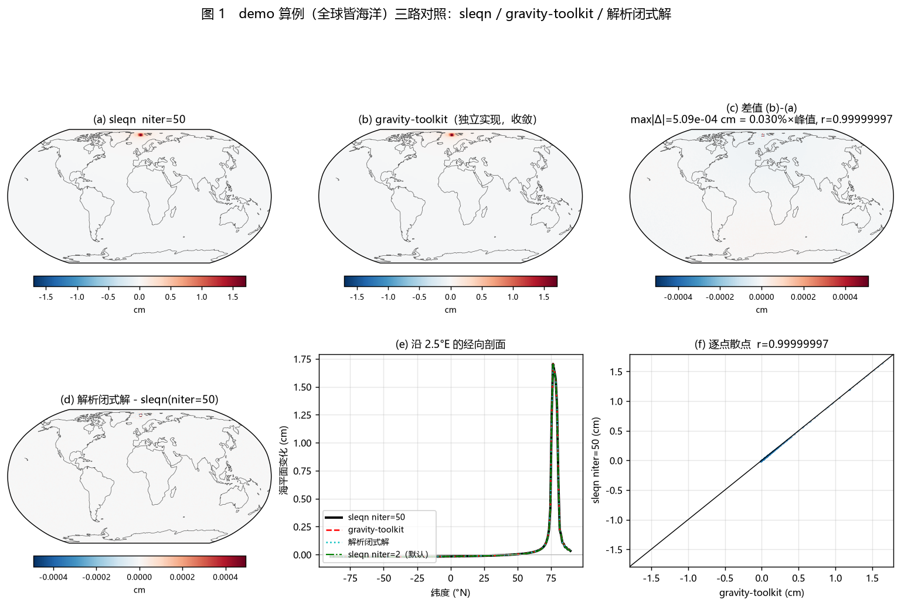
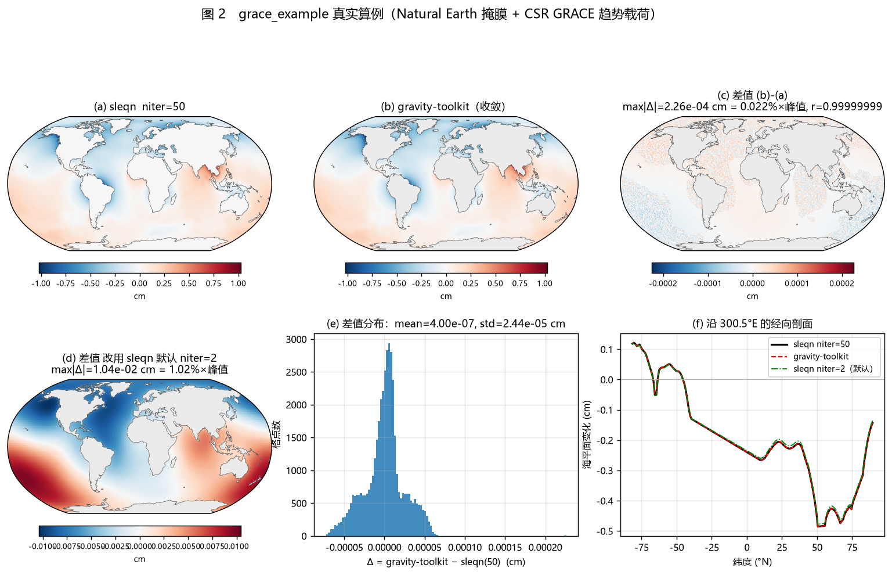
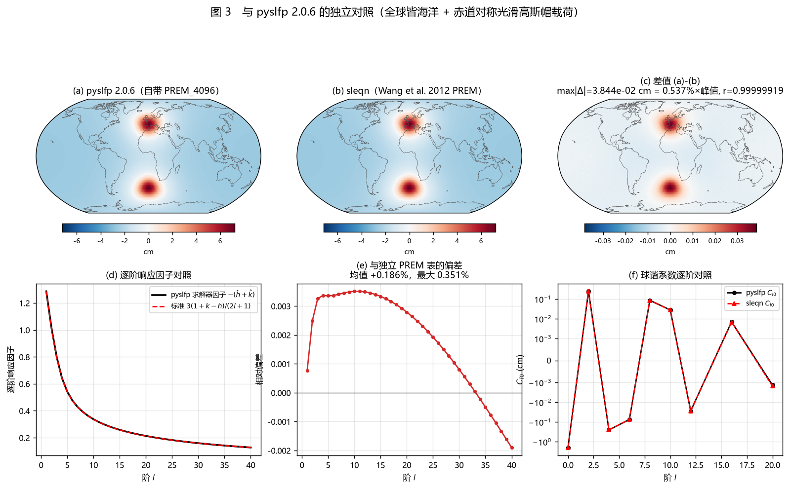
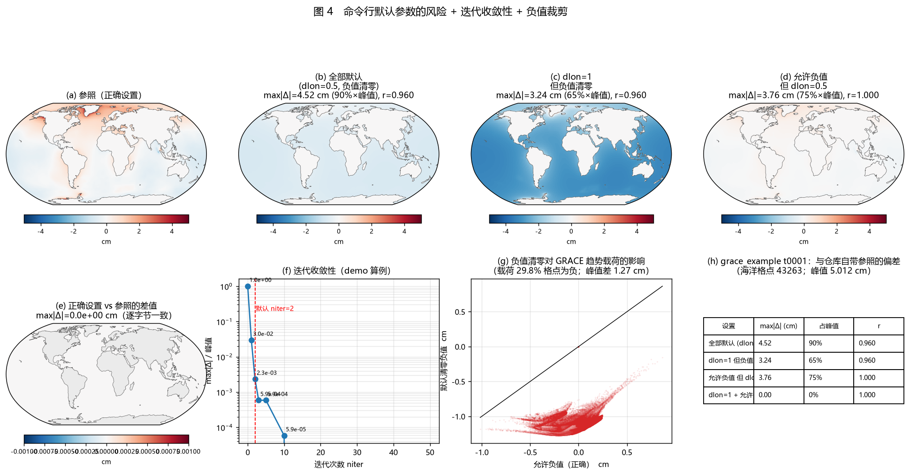

# sleqn（海平面指纹程序）第三方工具交叉验证报告

**验证对象**：`D:\华为家庭存储\mywork\sealevel` 下的 `sleqn.f90` / `sleqn_dp.f90` /
`sleqn.py` / `sleqn_fast.py` / `sleqn_gui.py` 及其配套数据与文档。

**日期**：2026-09-13　**机器**：本机 Windows，gfortran 16.1.0 (MinGW-w64 UCRT)

---

## 0. 一句话结论

`sleqn` 的**数值内核是正确的**：与两套完全独立的第三方实现（gravity-toolkit、
pyslfp）以及一个解析闭式解对比，同一载荷、同一海陆掩膜下全场最大偏差

| 对照 | 算例 | max\|Δ\| / 峰值 |
| --- | --- | --- |
| 解析闭式解（全球皆海洋，球谐域对角化） | demo | **0.029 %** |
| gravity-toolkit `sea_level_equation`（独立实现） | demo 全海洋 64800 格点 | **0.030 %** |
| gravity-toolkit `sea_level_equation` | grace 真实掩膜+真实 GRACE | **0.022 %** |
| gravity-toolkit vs 解析闭式解（两个参考之间） | demo | **0.0045 %** |
| pyslfp 2.0.6（自带 PREM_4096 + 自带求解器） | 全海洋 + 光滑载荷 | **0.537 %** |

`sleqn.py` 与修正版 `sleqn_dp.f90` 输出**逐字节相同**；原文版 `sleqn.f90` 与二者相差
0.33 %（即 README §6 记录的两处数值缺陷）。

但**命令行默认参数对真实 GRACE 数据会静默地给出错误结果**（见 §5.1），这是本次验证
发现的最重要问题。

---

## 0.1 对比图

四张对比图在 `_verify/figs/`（脚本 `_verify/make_verify_figs.py`）：

| 图 | 内容 |
| --- | --- |
| `fig1_demo_三路对照.png` | demo 算例：sleqn / gravity-toolkit 两幅场 + 两个差值场 + 经向剖面 + 散点 |
| `fig2_grace_真实算例.png` | grace_example 真实算例：两幅场 + niter=50 差值（2.2e-4 cm）+ niter=2 差值（1.0e-2 cm）+ 差值直方图 + 剖面 |
| `fig3_pyslfp_对照.png` | 与 pyslfp 对照：两幅场 + 差值 + 逐阶响应因子 + 相对偏差 + 球谐系数逐阶 |
| `fig4_默认参数与收敛性.png` | 四种命令行调用的结果对比 + 收敛曲线 + 负值裁剪散点 + 统计表 |









---

## 1. 工具可用性与安装情况

| 工具 | 状态 | 说明 |
| --- | --- | --- |
| **gravity-toolkit** | ✅ 已安装并实际运行 | PyPI `gravity-toolkit==1.2.7`，装在独立 venv（Python 3.12.13）。自带 PREM 负荷勒夫数与海陆掩膜，**离线可用** |
| **pyslfp** | ✅ 已安装并实际运行 | PyPI `pyslfp==2.0.6`（依赖 pyshtools/pygeoinf/cartopy…），Python 3.12.13 |
| gravity-toolkit 的 `run_sea_level_equation.py` | ⚠️ 脚本本身未直接跑 | 它需要 netCDF4 格式的球谐输入文件；本次改为**直接调用其核心求解函数** `gravity_toolkit.sea_level_equation()`，可完全控制输入载荷与掩膜，对比更严格（见 §3） |
| **ISSM Slr** | ❌ 未能运行 | 无 PyPI 包（`issm` 404）；ISSM 本体是 ~134 MB 的 C++ 源码，需自行编译核心 + PETSc + MATLAB/Python 绑定。PyPI 上的 `pyISSM` 只是 ACCESS-NRI 的前端封装，不含求解器。已核对[官方文档](https://issmteam.github.io/ISSM-Documentation/using-issm/capabilities/slr)中的接口与参数表（`md.slr.*`、`md = solve(md,'Slr')`），但未做数值验证 |
| **CALSEA** | ❌ 无法获取 | 未找到公开代码仓库或下载页；公开信息只有论文中的引用（如 [Nature Communications 2021](https://pmc.ncbi.nlm.nih.gov/articles/PMC8016857/) 的软件引用条目） |

**pyslfp 数据来源的坑**：它的勒夫数/冰模型等外部数据要从 Zenodo
（record 22251209）首次使用时自动下载。本机网络对该域名多次返回
`403 Access to this resource has been restricted due to unusual traffic`
（Cloudflare），重试数十次后才成功一次。若换台机器复现，请预留时间或预先准备好
`~/.pyslfp_data/love_numbers/PREM_4096.dat`。

### 另一个环境限制（值得记录）

**netCDF4 无法打开含中文的路径**。本机实测：

```
netCDF4.Dataset(r'D:\华为家庭存储\...\landsea_hd.nc')  -> FileNotFoundError
netCDF4.Dataset(r'C:\Users\...\Temp\slverify\landsea_hd.nc') -> OK
```

因此所有涉及 netCDF 的第三方工具运行都放在纯 ASCII 目录
`%TEMP%\slverify` 下。`sleqn` 本身只读写纯文本，不受影响。

---

## 2. 方法：如何做到"可控对照"

核心技巧：**把 sleqn 内部实际使用的载荷球谐系数原样取出**，再喂给第三方求解器。
做法是挂钩 `sleqn.gdisc`：

```python
orig = sleqn.gdisc
def wrapper(rlon, rlat, area, rmass, synthc, synths, lmost, rk):
    cap['c'] = synthc          # 抓住同一个数组对象
    return orig(...)
sleqn.gdisc = wrapper
sleqn.solve_one(...)           # 正常跑
sleqn.gdisc = orig
T_raw = cap['c'] / sleqn.ARAD  # 这是 gravity_toolkit 的 loadClm 约定
```

这样两边用的载荷系数**逐位相同**，差异只可能来自求解器本身。
掩膜、`dlon/dlat`、迭代次数全部显式指定。另外把 `sleqn.RHOAVE` / `sleqn.ARAD`
临时对齐到 gravity-toolkit 的 `rho_e=5.513407397554864` /
`rad_e=637100079.0009159`（sleqn 用 5.517 / 6.371e8），以消除已知的常数选择差异。

---

## 3. 交叉验证结果

### 3.1 仓库自带自检

```
python selftest_sleqn.py    ->  7/7 项全部通过（8.3 s）
```
7 项分别是：质量守恒、线性性、迭代生效、指纹形态、输出网格顺序、E12.4 格式、
E 格式边界值。全部与 README §9 的描述一致。

### 3.2 Fortran ↔ Python

两个源文件用 `gfortran -O2 -static` 均编译通过（退出码 0）。用 `demo/` 算例端到端比对：

| 对比 | 结果 |
| --- | --- |
| 新编译的 `sleqn_dp.f90` ↔ `sleqn.py --fmt e12.4` | **64800/64800 行逐字节相同** |
| 仓库自带 `sleqn_dp_static.exe` ↔ 同上 | **逐字节相同** |
| 新编译的 `sleqn.f90`（原文版）↔ 同上 | 64303/64800 行不同（99.23 %），max\|Δ\|=3.40e-3 cm，占峰值 1.0350 cm 的 **0.33 %** |
| 仓库自带 `sleqn_static.exe` ↔ 同上 | 同上 |

与 README §8 的数字完全吻合，说明**仓库里的两个 exe 确实分别由这两个源文件编译而来**。

### 3.3 与 gravity-toolkit 的独立实现对比

`gravity_toolkit.sea_level_equation()` 是 Tamisiea et al. (2010) 一系的独立实现
（不同作者、Clenshaw 求和、球谐域海洋函数），与 sleqn 的公式同源但代码完全独立。

**demo 算例**（全球皆海洋，100 个 0.5° 载荷单元，PREM 勒夫数）：

| 对照 | max\|Δ\| | 占峰值 1.704 cm | 相关系数 |
| --- | --- | --- | --- |
| gravity-toolkit（收敛） vs sleqn `niter=50` | 5.09e-4 cm | **0.030 %** | 0.99999997 |
| gravity-toolkit（收敛） vs sleqn `niter=2`（默认） | 3.69e-3 cm | 0.217 % | 0.99990794 |

**grace_example 算例**（Natural Earth 真实海陆掩膜，43263 个海洋格点，
CSR GRACE/GRACE-FO RL06.3 mascon 真实趋势载荷）：

| 对照 | max\|Δ\| | 占峰值 1.024 cm | 相关系数 |
| --- | --- | --- | --- |
| gravity-toolkit（收敛） vs sleqn `niter=50` | 2.26e-4 cm | **0.022 %** | 0.99999999 |
| 同上（改用仓库自带的 Wang et al. 2012 勒夫数表、CE 参考框架） | 2.26e-4 cm | **0.022 %** | 0.99999999 |
| gravity-toolkit（收敛） vs sleqn `niter=2`（默认） | 1.05e-2 cm | 1.03 % | 0.99987850 |

### 3.4 解析闭式解

全球皆海洋时海平面方程在球谐域**逐阶对角化**：

```
S_lm = coefp_lm · T_lm / (1 − coefh_lm)      (l ≥ 1)
S_00 = −tmass / (ρ_w a² · 4π)                （质量守恒）
```

按此构造闭式解并用 sleqn 自己的合成算符合成空间场：

| 对照 | max\|Δ\| | 占峰值 | 相关系数 |
| --- | --- | --- | --- |
| 闭式解 vs sleqn `niter=50` | 4.94e-4 cm | 0.029 % | 0.99999997 |
| 闭式解 vs gravity-toolkit（两个独立参考之间） | 7.63e-5 cm | **0.0045 %** | 0.99999998 |

两个互相独立的参考彼此吻合到 4.5e-5 相对量级，而 sleqn 与它们相差 0.03 %。
这 0.03 % 来自 `geoid()` 分析算符与合成算符在 1° 网格上的**混叠**
（`Σ_i P_lm(θ_i)P_l'm(θ_i) sinθ_i Δθ ≠ δ_ll'`，往返检验中 l=1 出现约 3 % 偏差），
属于中点求积的固有性质，不是算法错误。

### 3.5 与 pyslfp 的独立实现对比

pyslfp 是另一个完全独立的实现（Al-Attar 等 2024 的 Hilbert 空间/算子框架）。
对照设计：

* 两边都解同一个问题：**全球皆海洋** + 同一个解析定义的光滑高斯帽载荷
  （±45° 各一个，关于赤道对称 —— 这样 l=2,m=1 系数严格为 0，两边都不会触发
  rotational feedback，避免了两套极移实现的差异）；
* pyslfp 用**它自己的** `PREM_4096.dat` 勒夫数与自己的求解器；
* sleqn 用**第三套独立**勒夫数表（gravity_toolkit 的 Wang et al. 2012 PREM，CE 框架）。

**逐阶响应因子**（pyslfp 求解器实际使用的 `F_l = −(h_nd + k_nd/g)` 对比标准
`3(1+k−h)/(2l+1)`，在 pyslfp 的非量纲化下 `4πG_nd ≡ 3`）：

```
  l     pyslfp F_l     标准(Wang12 CE)     偏差
  1      1.286649         1.285668      +0.076%
  2      1.013908         1.011383      +0.250%
  5      0.542093         0.540280      +0.336%
 10      0.337383         0.336202      +0.351%
 20      0.213541         0.212947      +0.279%
 40      0.127622         0.127865      −0.190%
l=1..40：平均 +0.186%，标准差 0.168%，最大 0.351%
```

**空间场**（pyslfp 场插值到 sleqn 的 1° 网格）：

| 指标 | 数值 |
| --- | --- |
| max\|Δ\| | 3.84e-2 cm（峰值 7.159 cm）→ **0.537 %** |
| 相关系数 | 0.99999919 |
| 载荷中心（近场） | pyslfp −2.0746 cm vs sleqn −2.0760 cm（0.07 %） |
| 对跖点（远场） | pyslfp −2.0962 cm vs sleqn −2.0980 cm（0.09 %） |
| 逐阶 C_l0（l = 0,2,4,8,10） | 差 0.10 % ~ 0.93 % |
| 奇数次阶 | 两边都在 1e-9 cm 量级（赤道对称性检验通过） |
| 质量守恒 | sleqn zmass = −9933.768 Gt，载荷 +9933.768 Gt（严格相反数） |

0.5 % 的残差与上面 0.19 % 的勒夫数表差异 + 两者网格/半径差异
（pyslfp 用 6368 km 海床半径，sleqn 用 6371 km）量级一致。

### 3.6 加速内核 `sleqn_fast.py`

仓库自带 `verify_sleqn_fast.py`：**11/11 项逐字节相同**，覆盖不同数据源/网格分辨率/
经度集合/行序/`niter=0,2`/`lmax=20,60,120,180`，以及完整的 `grace_example`
（64800 单元，102.7 s → 10.1 s），且与仓库中已有的结果文件逐字节一致。

### 3.7 GUI

无头（`QT_QPA_PLATFORM=offscreen`）冒烟测试通过：窗口构造正常，**默认参数正确**
（允许负值载荷 = 勾选、`dlon=dlat=1.0`、加速内核 = 勾选），后台线程能跑完 demo 算例
并写出结果文件（与命令行一致）。

---

## 4. 对 README 中两项"修正"的独立证实

这是本次验证的一个额外收获。

### 修正 2（`pmh` 分母应为 `2·2+1=5` 而不是 `2·181+1=363`）

把 sleqn 的极移系数与 gravity-toolkit 的独立实现逐项对照：

```
sleqn  pmh                = 0.264556737381
gravity_toolkit coefh[2,1] = 0.264556737381    差 5.6e-17
sleqn  pmp                = 3.500953947975
gravity_toolkit coefp[2,1] = 3.500953947975    差 0
中间量 coefpm == coefpmf   = 0.746960750219    差 0
```

即：sleqn 修正版用的 `pmh`/`pmp` 与 gravity-toolkit（Tamisiea et al. 2010 eq.11 +
Kendall et al. 2005 极移反馈）**代数完全等价、数值逐位一致**。而按原文 Fortran 的
`2·181+1=363` 写出的 `pmh` 只有 0.003644，是正确值的 **1/72.6** —— 与 README 所说
"削弱约 72 倍"完全吻合。

**结论：修正 2 是对的，并且被一个独立的公开实现所证实。**

### 修正 1（单精度字面常量）

只有修正版与 gravity-toolkit / 解析解吻合到 0.02 %~0.03 %；原文版差 0.33 %。
这也反证了修正 1 的必要性。

### 极移反馈开关（`polar=True/False`）的独立验证

`sleqn.py`/GUI 新增了极移（polar motion）反馈的运行期开关（命令行 `--no-polar`、
库调用 `polar=False`、GUI 复选框），默认 `True`。开关必须满足"只动 $(l,m)=(2,1)$、
不动别的"，为此新增脚本 `_verify/verify_polar_switch.py`，四组判据 **12/12 通过**：

| 判据 | 内容 | 结果 |
| --- | --- | --- |
| A1 | 全球海洋闭合解 $S_{lm}=\mathrm{coefp}_{lm}T_{lm}/(1-\mathrm{coefh}_{lm})$（分别用带/不带极移的 $(2,1)$ 权重） | 两种状态与 sleqn 的 `max|Δ|` = 5.08e-5 cm，仅占峰值 7.1e-5 —— 即 1° 网格中点求积的固有水平，与开关无关 |
| A2 | 差场（开 − 关）的 $(2,1)$ 系数 vs 两个闭合解的 $(2,1)$ 系数之差 | 相对偏差 **1.7e-5**（$C_{21}$）/ **2.3e-5**（$S_{21}$）；合成→分析往返误差本身只有 6.2e-9 |
| B | 赤道镜像载荷（$(2,1)$ 系数严格为 0，$|T_{21}|=2.5\times10^{-11}$） | 开/关结果**逐点完全相同**（`max|Δ| = 0`）——证明开关不碰任何其它通道 |
| C | 开/关差场的球谐谱 | $(2,1)$ 占总功率 **99.9999 %**，次强项只有 9.2e-8（相对 1.4e-3 的 $(2,1)$ 振幅） |
| D | gravity-toolkit `sea_level_equation`（**同一套勒夫数**）`POLAR=True` / `POLAR=False` | 分别相差峰值的 **0.026 %** / **0.038 %**，与既有的 `POLAR=True` 结论同一量级 |

另外，`selftest_sleqn.py` 新增第 8 项检验（关极移后仍严格质量守恒、差场 $(2,1)$
功率占比 100 %）、GUI 自检新增 3 项（默认勾选、关掉后仍守恒、取消勾选经
`on_run`/`ComputeThread` 后与直接调用 `polar=False` 完全一致）。

**未受影响的回归**：`verify_sleqn_fast.py` 11/11 项仍逐字节相同（含 grace_example
64800 单元与仓库既有结果文件），`sleqn_gui.py --selftest` 18/18 通过 ——
即默认路径（`polar=True`）的数值结果与改动前完全一致。

---

## 5. 发现的问题（按严重程度）

### 5.1 【高】命令行默认参数对真实 GRACE 数据静默出错

`sleqn.py` 的默认值是 `--dlon 0.5 --dlat 0.5` 且**不裁剪负值需显式加
`--allow-negative`**（即默认把负载荷清零）。而仓库自带的 `grace_example` 是 1° 网格、
载荷有正有负（t0001：**69.0 % 的格点为负**；趋势文件 29.8 % 为负）。

用 `grace_example/load_grace_t0001_1deg.txt` 做四组对照，以仓库自带的
`grace_example/slf_grace_t0001_1deg.txt` 为正确参照：

| 调用方式 | max\|Δ\| | 占峰值 5.012 cm | 与正确场的相关系数（43263 个海洋格点） |
| --- | --- | --- | --- |
| 全部默认（`dlon=0.5`，负值清零） | 4.52 cm | **90.3 %** | **0.9596** |
| `--dlon 1 --dlat 1`（仍清零负值） | 3.24 cm | 64.6 % | **0.9596** |
| `--allow-negative`（仍用 0.5°） | 3.76 cm | 75.0 % | 1.0000（形状对，幅度小 4 倍） |
| `--dlon 1 --dlat 1 --allow-negative`（正确） | 0 | 0 % | 1.0000（逐字节一致） |

> 说明：这里刻意按**海洋格点**统计。若把陆地上的 0 也一起算，前两行的相关系数会掉到
> 0.230 —— 那是 21537 个 (0,0) 点远离联合均值造成的伪影，不代表解更差。

见 `_verify/figs/fig4_默认参数与收敛性.png` 的 (a)~(d)：前三种调用的海平面指纹图
与正确结果肉眼可辨地完全不同（`max|Δ|` 达峰值的 65 %~90 %），而程序在这三种情况下
**都不打印任何警告**。

程序在这四种情况下**都不打印任何警告**。README §2.4 与 §4 有文字说明，但用户很容易
照着 README §1.1 的通用命令行直接跑而得到完全错误却"看起来正常"的结果。

**建议**（任选其一，按优先级）：
1. 把 `clip_negative` 默认改为 `False`（不裁剪），把"与原文 Fortran 一致"做成显式选项；
2. 至少在检测到负值载荷时打印醒目警告，并统计被清零的格点比例与质量；
3. `dlon/dlat` 能由掩膜或数据文件自动推断，或与实际不一致时给出警告。

（GUI 没有这个问题：它的默认值是正确的。）

### 5.2 【中】默认 `niter=2` 未收敛

demo 算例（对照 `niter=200` 收敛解）：

| niter | max\|Δ\| vs 收敛解 | 占峰值 |
| --- | --- | --- |
| 0 | 1.72 cm | 100.75 % |
| 1 | 5.10e-2 cm | 2.99 % |
| **2（默认）** | **4.00e-3 cm** | **0.235 %** |
| 3 | 1.00e-3 cm | 0.059 % |
| 10 | 1.00e-4 cm | 0.006 % |
| 20 及以上 | 0 | 0 % |

grace 真实算例上默认 `niter=2` 与收敛解差 **约 1 %**（峰值，实测 1.02 %~1.03 %），
mean|Δ| = 4.65e-3 cm。
对精度要求高的分析（趋势、区域平均）建议 `niter≥10`。

### 5.3 【低】`Filelist.txt` 带 UTF-8 BOM 时解析失败

`sleqn.py` 用 `open(list_file, 'r', encoding='utf-8')` 读取控制文件。若文件带 BOM
（Windows PowerShell 的 `Set-Content -Encoding UTF8`、部分编辑器默认如此），第一行
文件名会带上 `\ufeff`，导致 `FileNotFoundError`。本次验证中实际踩到。

**建议**：改用 `encoding='utf-8-sig'`（对无 BOM 文件行为不变）。

### 5.4 【信息】勒夫数参考框架未在接口中说明

`sleqn` 不含参考框架（CM/CF/CE）选项，直接用表里的值。而
`grace_example/love_numbers` 实际是 Wang et al. (2012) 的 **CE/原始** 值
（与 gravity-toolkit `REFERENCE='CE'` 在 l≥1 上逐位一致，l=0 置 0），
gravity-toolkit 默认的 `CF` 会给出不同的 l=1 值（h₁ = −0.2595 vs −0.2857，
k₁ = +0.0262 vs 0）。两者都合法，但用户需要知道自己在用哪一个。
建议在 README 中明确写出算例所用勒夫数的参考框架。

### 5.5 【信息】杂项（不影响本次结论）

* `gdisc` 中 `alpha = dcos(clat)` 确是死代码（README §6 已注明，确认属实）。
* 极点附近 `rsin**m`（m 到 180）下溢，运行时 stderr 出现 IEEE_UNDERFLOW/DENORMAL
  提示，属正常（README §8.3 已说明，确认属实）。
* 载荷/输出网格固定 360×180（1°），`lmax>180` 只是数学截断；代码会给出提示。
* 原 Fortran 版输出文件已存在时不会 `Close`，重复运行会报 "Cannot write to file
  opened for READ"；`sleqn.py` 已修正，`demo/运行_*.bat` 也用 `del` 规避。

---

## 6. 复现方式

隔离环境（不改动用户现有 conda 环境）：

```powershell
# 参考工具（已在 _verify/ 下建好）
uv venv _verify\venv-gravtk  --python 3.12 ; uv pip install --python _verify\venv-gravtk\Scripts\python.exe  gravity-toolkit netCDF4
uv venv _verify\venv-pyslfp  --python 3.12 ; uv pip install --python _verify\venv-pyslfp\Scripts\python.exe  pyslfp
```

脚本（都在 `_verify/` 下；netCDF 相关工具必须用纯 ASCII 工作目录 `%TEMP%\slverify`）：

| 脚本 | 作用 |
| --- | --- |
| `verify_slf.py` | sleqn ↔ gravity-toolkit ↔ 解析闭式解，三路对照。`--case demo|grace`、`--love gravtk|file`、`--gravtk-ref CF|CM|CE`、`--iters 2 50`、`--align` |
| `verify_fortran.py` | 重新编译两个 Fortran 源文件，与 `sleqn.py` 做逐字节比对 |
| `verify_features.py` | 负值裁剪影响、迭代收敛表、勒夫数表比对 |
| `verify_polar_switch.py` | 极移反馈开关（`polar=True/False`）：闭合解、赤道镜像载荷、差场谱、`--gravtk` 时另与 gravity-toolkit 的 `POLAR=True/False` 对照 |
| `verify_pyslfp_full.py` | sleqn ↔ pyslfp 全场 + 逐阶对照（pyslfp venv 运行） |
| `dump_fields.py` / `dump_pyslfp.py` | 把各路对比场落盘成 `.npz`（分别在 gravtk / pyslfp venv 运行） |
| `make_verify_figs.py` | 生成 §0.1 的四张对比图（pzr env，需要 cartopy） |
| `dbg_analytic.py` | 合成/分析算符往返检验（混叠量级） |
| `smoke_gui.py` | GUI 无头冒烟测试 |

典型命令：

```powershell
# 三路对照（demo）
& _verify\venv-gravtk\Scripts\python.exe _verify\verify_slf.py --case demo --love gravtk --iters 2 50 --align
# grace 真实算例
& _verify\venv-gravtk\Scripts\python.exe _verify\verify_slf.py --case grace --love file --gravtk-ref CE --iters 2 50
# Fortran 一致性
& "$env:USERPROFILE\anaconda3\envs\pzr\python.exe" _verify\verify_fortran.py
# 极移反馈开关
& _verify\venv-gravtk\Scripts\python.exe _verify\verify_polar_switch.py --gravtk
# pyslfp 对照
& _verify\venv-pyslfp\Scripts\python.exe _verify\verify_pyslfp_full.py
```

---

## 7. 验证覆盖度与遗留

**已验证**：数值内核（质量守恒、迭代、球谐变换、极移项）、载荷离散化、
海陆掩膜处理、输出格式与网格顺序、Fortran/Python 一致性、加速内核等价性、
GUI 可用性、若干输入健壮性。

**未验证**：
* 与**真实观测**（GRACE 反演的海平面指纹、验潮站）的比对——本次只做了实现之间
  的交叉验证，没有独立观测数据；
* ISSM Slr（需自行编译 ISSM）；
* CALSEA（无公开代码）；
* `make_report_figs.py` / `make_grace_example.py` / `sleqn_gui.py` 的绘图与
  交互细节只做了冒烟级检查。

---

## 8. 主要参考

* gravity-toolkit：<https://github.com/polargeodesy/gravity-toolkit>
  （`scripts/run_sea_level_equation.py` @ 6235f36；核心函数 `gravity_toolkit.sea_level_equation`）
* pyslfp：<https://pypi.org/project/pyslfp/> / <https://github.com/da380/pyslfp>
  （Al-Attar, Syvret, Crawford, Mitrovica & Lloyd, 2024, *GJI* 236(1), 362–378）
* ISSM Slr 文档：<https://issmteam.github.io/ISSM-Documentation/using-issm/capabilities/slr>
  （Adhikari, Ivins & Larour, 2016, *GMD* 9(3), 1087–1109）
* Tamisiea et al. (2010) —— gravity-toolkit 与 sleqn 共同遵循的 sea level equation 形式
